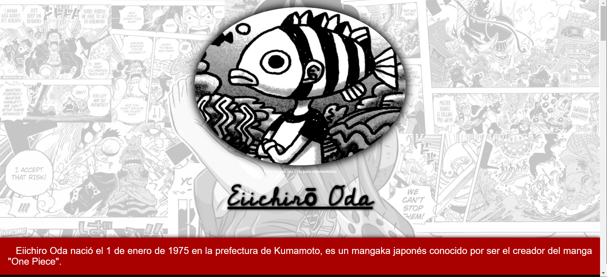
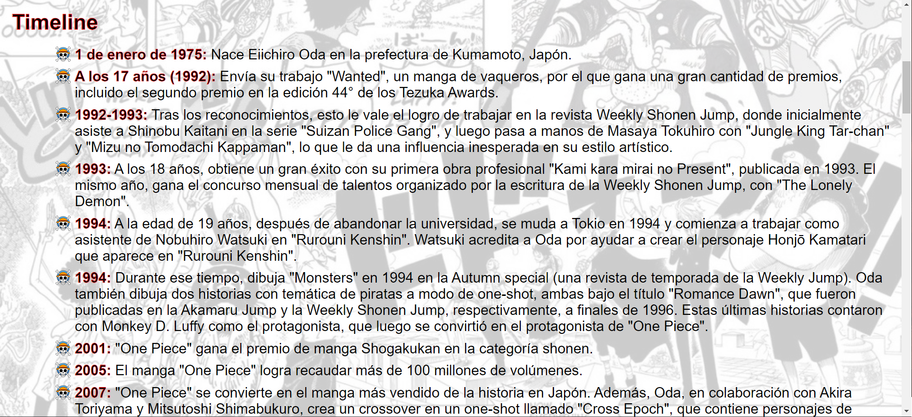
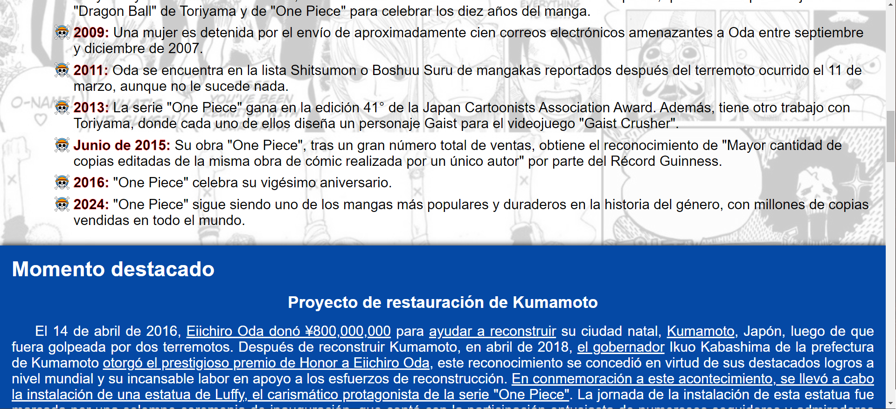
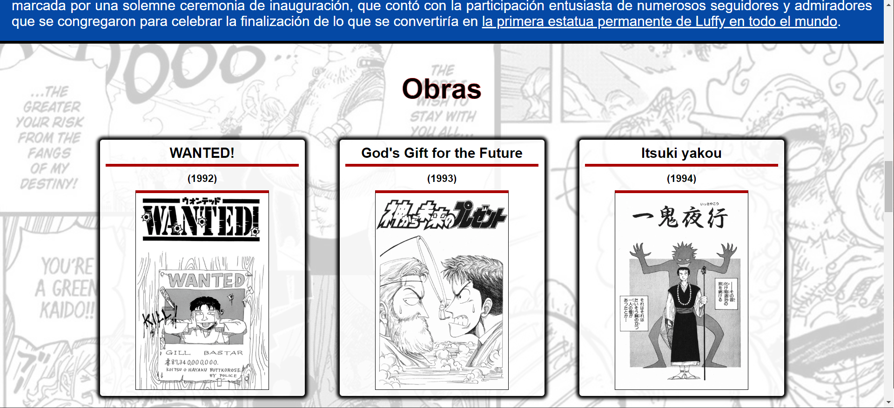
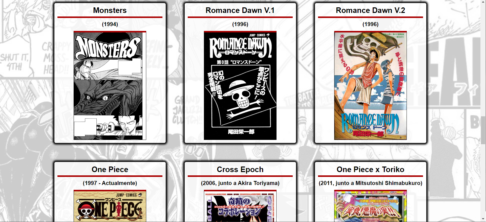
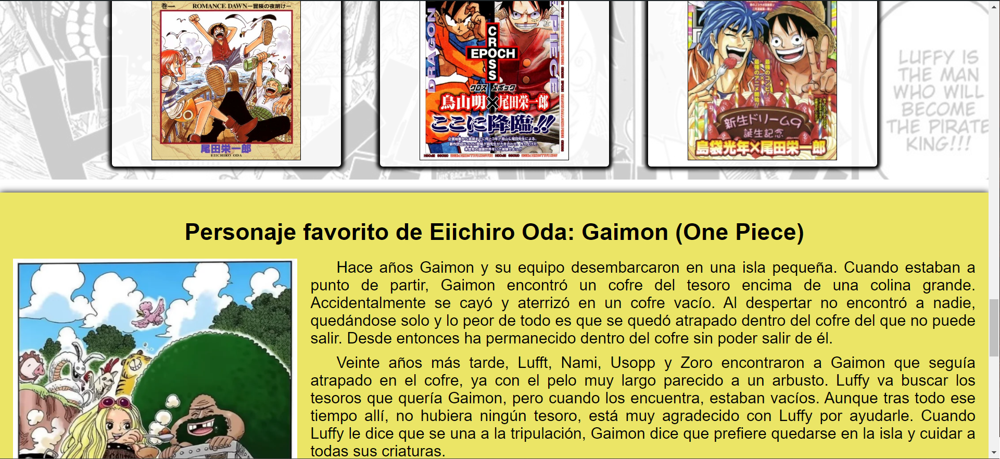
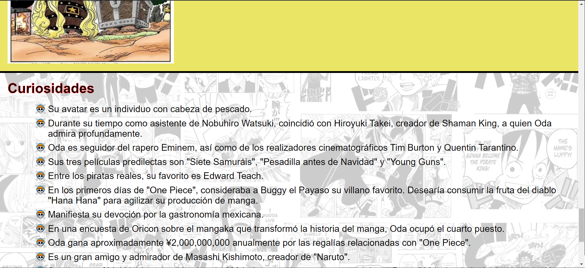
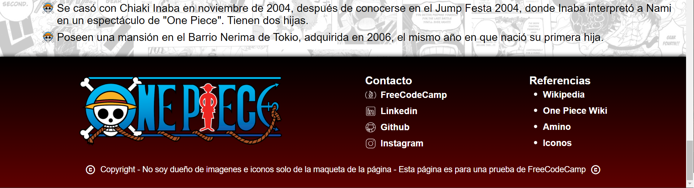

<h1 align='center'>Proyecto final N°2 del curso Responsive Web Design de FreeCodeCamp</h1>

> Este proyecto es 2/5 para la certificación del curso.

## Página de homenaje a Eiichirō Oda (One Piece):
Objetivo: Construir una aplicación que sea funcionalmente similar a https://tribute-page.freecodecamp.rocks. No copies este proyecto de demostración.

### Historias de usuario (Descripción): 
1. El <code>main</code> debe tener un <code>id</code> correspondiente de <code>main</code>, que contiene los demás elementos.
2. La página debe tener un elemento <code>id</code> de <code>title</code>, el cual contendrá una cadena de caracteres (p. ej. texto), que describe el tema de la página de homenaje (p. ej. "Dr. Norman Borlaug").
3. La página debe tener tanto un elemento <code>figure</code> o un elemento <code>div</code> con un <code>id</code> de <code>img-div</code>.
4. Dentro del elemento <code>#img-div</code> debe haber un elemento <code>img</code> con su correspondiente <code>id="image"</code>.
5. Dentro del elemento <code>#img-div</code>, debes ver un elemento con un <code>id="img-caption"</code> correspondiente que contiene contenido textual describiendo la imagen mostrada en <code>#img-div</code>.
6. Debe tener su correspondiente elemento <code>id="tribute-info"</code>, que contendrá una descripción textual del sujeto de la página tributo.
7. Debes ver un elemento <code>a</code> con su <code>id="tribute-link"</code> correspondiente, que contiene información adicional sobre el tema de la página de homenaje. <code>CONSEJO: Debes dar al elemento un atributo target y establecerlo como _blank</code> para que tu enlace se abra en una nueva pestaña.
8. Tú <code>#image</code> debe usar las propiedades <code>max-width</code> y <code>height</code> para redimensionarse en función de la anchura de su elemento padre, sin sobrepasar su tamaño original.
9. Tu elemento <code>img</code> debe estar centrado con respecto al elemento que lo contiene.

### Pruebas (Pruebas Técnicas a pasar): 
- 🧪 Debes tener un elemento <code>main</code> con un <code>id</code> de <code>main</code>.
- 🧪 Tu <code>#img-div</code>, <code>#image</code>, <code>#img-caption</code>, <code>#tribute-info</code>, y <code>#tribute-link</code> deben ser descendientes de <code>#main</code>.
- 🧪 Debes tener un elemento con un <code>id</code> de <code>title</code>.
- 🧪 Tu <code>#title</code> no debe estar vacío.
- 🧪 Debes tener un elemento <code>figure</code> o <code>div</code> con un <code>id</code> de <code>img-div</code>.
- 🧪 Debes tener un elemento <code>img</code> con un <code>id</code> de <code>image</code>.
- 🧪 Tu <code>#image</code> debe ser descendiente de <code>#img-div</code>.
- 🧪 Deberías tener un elemento <code>figcaption</code> o <code>div</code> con un <code>id</code> de <code>img-caption</code>.
- 🧪 Tu <code>#img-caption</code> debe ser descendiente de <code>#img-div</code>.
- 🧪 Tu <code>#img-caption</code> no debe estar vacío.
- 🧪 Debes tener un elemento con un <code>id</code> de <code>tribute-info</code>.
- 🧪 Tu <code>#tribute-info</code> no debe estar vacío.
- 🧪 Debes tener un elemento <code>a</code> con un <code>id</code> de <code>tribute-link</code>.
- 🧪 Tu <code>#tribute-link</code> debe tener un atributo <code>href</code> con un enlace.
- 🧪 Tu <code>#tribute-link</code> debe tener un atributo <code>target</code> establecido en <code>_blank</code>.
- 🧪 Tu elemento <code>img</code> debe tener un <code>display</code> de <code>block</code>.
- 🧪 Tu <code>#image</code> debe tener un <code>max-width</code> de <code>100%</code>.
- 🧪 Tu <code>#image</code> debe tener un <code>height</code> de <code>auto</code>.
- 🧪 Tu <code>#image</code> debe estar centrado con respecto al elemento que lo contiene.
  
------------

### Instalación

Sigue estos pasos para instalar y ejecutar el proyecto localmente:

1. Clona este repositorio en tu máquina local utilizando Git:

    ```bash
    git clone https://github.com/Schugu/ProyectoFinalFreeCodeCamp2.git
    ```

2. Navega al directorio del proyecto:

    ```bash
    cd ProyectoFinalFreeCodeCamp2
    ```

3. ¡Listo! Ahora puedes comenzar a usar el proyecto.

------------

### Capturas de pantalla








